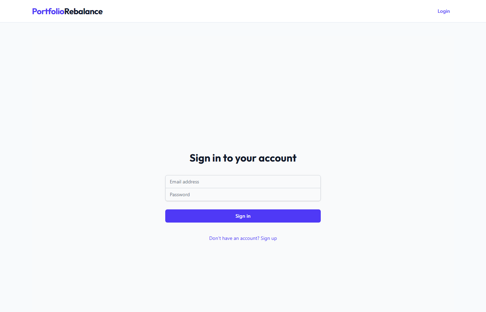
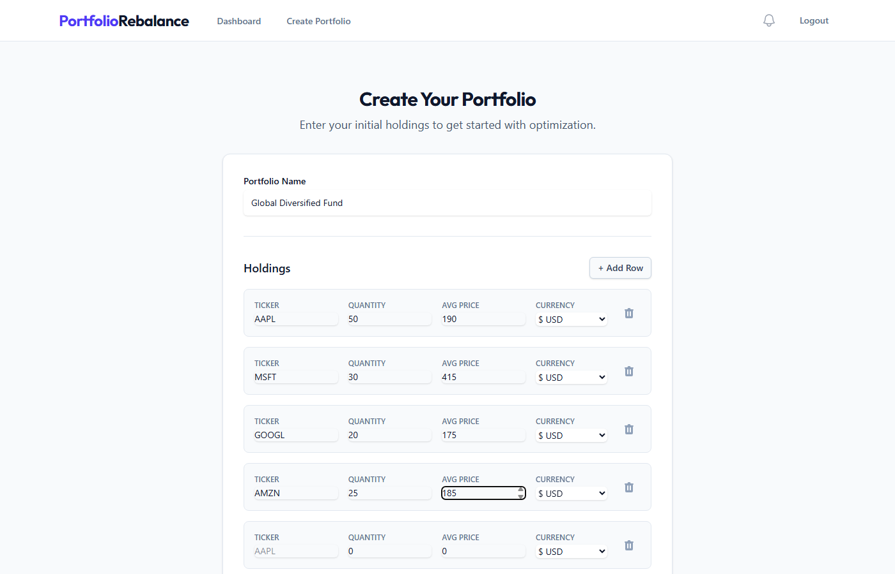
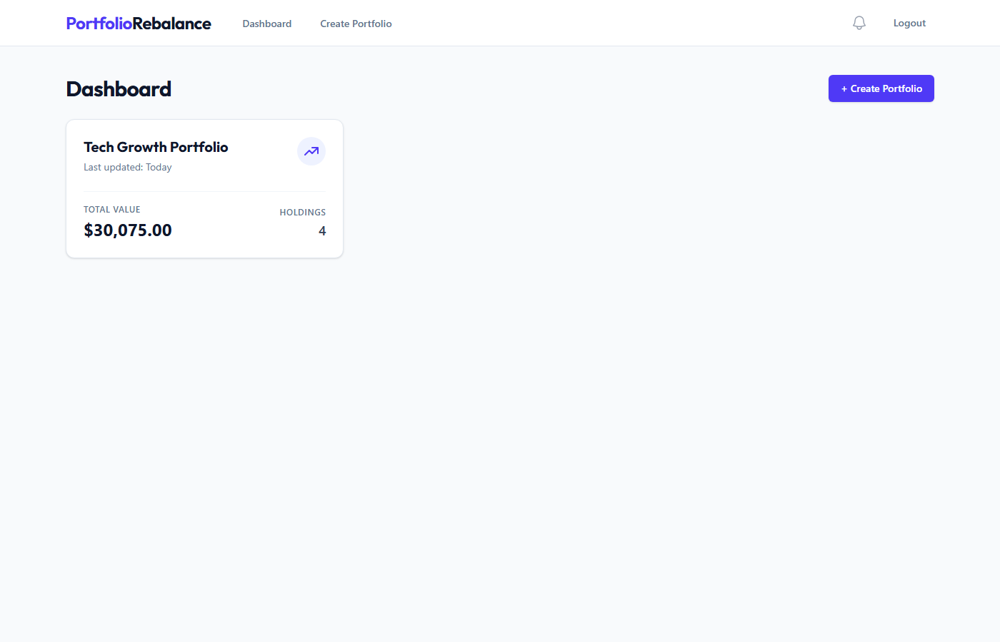
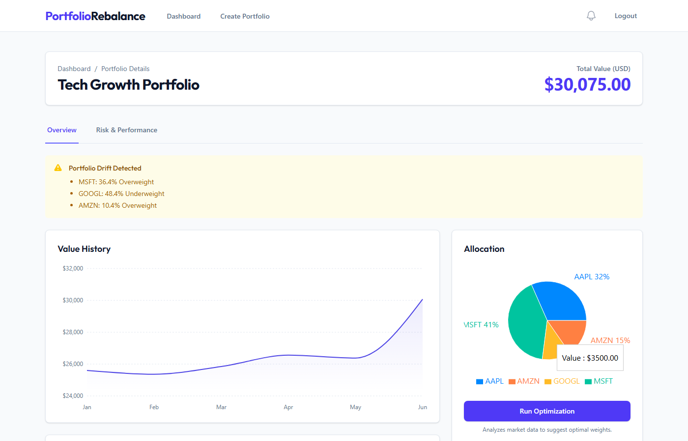
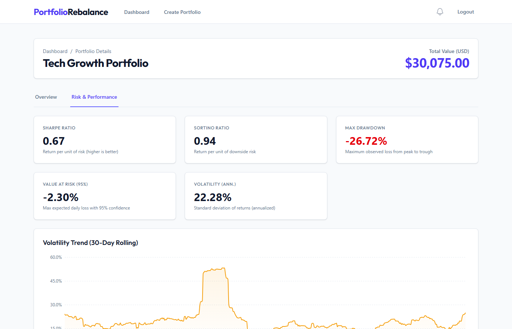

# DriftGuard — Portfolio Rebalancing System

DriftGuard is a full-stack web application that monitors investment portfolios for drift, runs mean-variance optimization to suggest rebalancing strategies, and delivers AI-generated explanations alongside real-time risk analytics.

---

## Screenshots

### Login


### Create Portfolio


### Dashboard


### Portfolio Overview — Value History, Allocation & Drift Alerts


### Risk & Performance Analytics


---

## Features

- **Portfolio management** — create multiple portfolios with holdings in USD, EUR, or INR
- **Real-time drift detection** — compares current weights against the last accepted rebalance and alerts when deviation exceeds 5%
- **Mean-variance optimization** — Ledoit-Wolf shrinkage covariance, EWMA returns, sentiment-adjusted variance, turnover penalty and diversification regularization
- **AI explanations** — Groq (Llama 3.3 70B) generates plain-English rationale for each optimization result
- **Risk analytics** — Sharpe ratio, Sortino ratio, max drawdown, 95% VaR, annualized volatility, 30-day rolling volatility chart
- **Sentiment analysis** — Finnhub news + TextBlob polarity scores per ticker, cached 12 hours
- **Email notifications** — SMTP alerts for portfolio drift, high volatility, and very negative news sentiment
- **Scheduled market tracking** — APScheduler runs every 4 hours; price data via yfinance with AlphaVantage fallback
- **Multi-currency support** — exchange rates from exchangerate-api.com, fallback static rates

---

## Architecture

```
DriftGuard/
├── backend/                  # FastAPI + SQLAlchemy
│   ├── app/
│   │   ├── api/
│   │   │   ├── endpoints/    # auth, portfolios, market, rebalance, backtest, currency, notifications
│   │   │   └── deps.py       # JWT auth dependency
│   │   ├── core/
│   │   │   ├── config.py     # pydantic-settings, reads .env
│   │   │   └── security.py   # argon2 hashing, JWT creation
│   │   ├── db/               # SQLAlchemy engine, session, Base
│   │   ├── models/           # ORM models
│   │   ├── services/
│   │   │   ├── market_data.py     # yfinance / AlphaVantage
│   │   │   ├── optimization.py    # scipy mean-variance optimizer
│   │   │   ├── risk.py            # Sharpe, Sortino, VaR, drawdown
│   │   │   ├── sentiment.py       # Finnhub + TextBlob
│   │   │   ├── market_tracking.py # scheduled drift/vol/sentiment checks
│   │   │   ├── email.py           # SMTP notifications
│   │   │   ├── llm.py             # Groq API explanation generator
│   │   │   └── currency.py        # exchange rate conversion
│   │   └── main.py           # FastAPI app, CORS, scheduler startup
│   ├── tests/
│   │   ├── conftest.py       # SQLite test DB, TestClient fixture
│   │   ├── test_auth.py      # 7 auth tests
│   │   └── test_portfolios.py # 7 portfolio tests
│   ├── .env.example          # environment variable template
│   └── requirements.txt
├── frontend/                 # React 19 + TypeScript + Tailwind CSS + Recharts
│   └── src/
│       ├── pages/            # Login, Dashboard, Onboarding, PortfolioDetails
│       ├── components/       # AllocationChart, VolatilityTrendChart, DriftAlert, ...
│       ├── services/         # axios wrappers for each API domain
│       └── context/          # AuthContext, NotificationContext
├── db/
│   └── init.sql              # PostgreSQL schema
└── docker-compose.yml        # PostgreSQL + ChromaDB services
```

---

## Quick Start

### Prerequisites

- Python 3.11+
- Node.js 20+
- PostgreSQL (or skip it — falls back to SQLite automatically)

### 1. Clone and configure

```bash
git clone https://github.com/Mohak0140/DriftGuard.git
cd DriftGuard
```

Copy the environment template and fill in your keys:

```bash
cp backend/.env.example backend/.env
```

Minimum required values in `backend/.env`:

```env
# Generate with: python -c "import secrets; print(secrets.token_urlsafe(32))"
SECRET_KEY=your-secret-key

# Free API keys (optional — app works without them using yfinance + mock AI)
ALPHAVANTAGE_API_KEY=  # https://www.alphavantage.co/support/#api-key
FINNHUB_API_KEY=       # https://finnhub.io/register
GROQ_API_KEY=          # https://console.groq.com
```

> The app runs without any API keys — yfinance is the primary price source (no key needed), and the AI explanation falls back to a static mock when `GROQ_API_KEY` is absent.

### 2. Backend

```bash
cd backend
pip install -r requirements.txt
uvicorn app.main:app --reload --port 8001
```

The database schema is created automatically on first startup (SQLite by default). To use PostgreSQL, start the Docker service first:

```bash
docker-compose up -d db
# then set POSTGRES_SERVER=localhost in backend/.env
```

### 3. Frontend

```bash
cd frontend
npm install
npm run dev
```

Open [http://localhost:5173](http://localhost:5173).

---

## Running Tests

```bash
cd backend
pytest tests/ -v
```

14 tests covering auth (signup, login, validation) and portfolio CRUD (access control, input validation, isolation between users).

---

## Environment Variables

| Variable | Required | Description |
|---|---|---|
| `SECRET_KEY` | **Yes** | JWT signing secret. Generate with `secrets.token_urlsafe(32)` |
| `DATABASE_URL` | No | Full DB URL. Auto-built from Postgres vars if omitted; falls back to SQLite |
| `POSTGRES_USER` | No | Default: `postgres` |
| `POSTGRES_PASSWORD` | No | Default: `postgres` |
| `POSTGRES_SERVER` | No | Set this to use PostgreSQL (e.g. `localhost`) |
| `POSTGRES_PORT` | No | Default: `5432` |
| `POSTGRES_DB` | No | Default: `portfolio_db` |
| `CORS_ORIGINS` | No | Comma-separated allowed frontend origins. Default: `http://localhost:5173,...` |
| `ALPHAVANTAGE_API_KEY` | No | Fallback price data when yfinance fails |
| `FINNHUB_API_KEY` | No | News data for sentiment analysis |
| `GROQ_API_KEY` | No | Groq API for AI rebalancing explanations |
| `SMTP_SERVER` | No | Default: `smtp.gmail.com` |
| `SMTP_PORT` | No | Default: `587` |
| `SMTP_USER` | No | Email address for sending notifications |
| `SMTP_PASSWORD` | No | SMTP password / app password |
| `SMTP_FROM_EMAIL` | No | From address in notification emails |

---

## API Reference

Interactive docs at [http://localhost:8001/docs](http://localhost:8001/docs).

| Method | Endpoint | Description |
|---|---|---|
| `POST` | `/api/auth/signup` | Register a new user |
| `POST` | `/api/auth/token` | Login, returns JWT |
| `GET` | `/api/portfolios/` | List all portfolios for the current user |
| `POST` | `/api/portfolios/` | Create a portfolio |
| `GET` | `/api/portfolios/{id}` | Get a portfolio by ID |
| `POST` | `/api/portfolios/{id}/holdings` | Add a holding |
| `PUT` | `/api/portfolios/{id}/holdings/{ticker}` | Update a holding |
| `DELETE` | `/api/portfolios/{id}/holdings/{ticker}` | Remove a holding |
| `GET` | `/api/portfolios/{id}/analytics` | Risk metrics (Sharpe, VaR, drawdown, …) |
| `POST` | `/api/rebalance/{portfolio_id}/optimize` | Run mean-variance optimization |
| `GET` | `/api/rebalance/optimizations/{id}` | Poll for AI explanation status |
| `POST` | `/api/rebalance/{portfolio_id}/apply` | Apply optimized weights to holdings |
| `GET` | `/api/market/search?q=` | Ticker autocomplete |
| `POST` | `/api/market/update` | Refresh price data for a list of tickers |
| `GET` | `/api/market/sentiment/{ticker}` | Sentiment score for a ticker |
| `GET` | `/api/market/volatility/{ticker}` | 30-day rolling volatility history |
| `GET` | `/api/notifications/` | Unread notifications for the current user |
| `POST` | `/api/notifications/{id}/read` | Mark a notification as read |

---

## Tech Stack

**Backend**
- FastAPI, SQLAlchemy, pydantic-settings
- JWT auth (python-jose), argon2 password hashing (passlib + argon2-cffi)
- scipy (mean-variance optimization), scikit-learn (Ledoit-Wolf covariance), numpy, pandas
- yfinance + AlphaVantage (price data), Finnhub (news), TextBlob (sentiment)
- OpenAI SDK → Groq (AI explanations), APScheduler (background jobs)

**Frontend**
- React 19, TypeScript, Vite
- Tailwind CSS v4, Recharts
- React Router v7, axios

**Infrastructure**
- PostgreSQL (production) / SQLite (dev fallback)
- Docker Compose for local services
