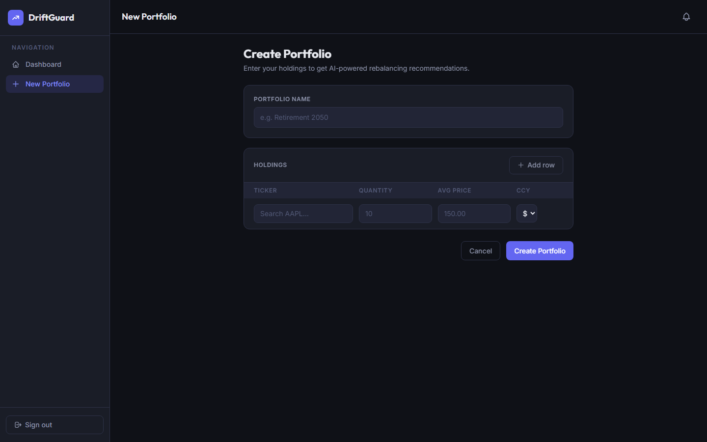

<div align="center">

# DriftGuard

**Intelligent portfolio rebalancing powered by mean-variance optimization and AI**

[](https://fastapi.tiangolo.com)
[](https://react.dev)
[](https://python.org)
[](https://typescriptlang.org)
[](LICENSE)

*Monitor drift. Optimize weights. Understand why.*

</div>

---

## What is DriftGuard?

DriftGuard is a full-stack portfolio management platform that continuously monitors your investment holdings for drift from target allocations, runs mean-variance optimization to suggest rebalancing strategies, and uses an LLM (Groq / Llama 3.3 70B) to generate plain-English explanations for every recommendation.

It's built for people who want quantitative rigour — Sharpe optimization, Ledoit-Wolf covariance shrinkage, sentiment-adjusted variance — without needing to write a single line of Python.

---

## Screenshots

### Login


### Sign Up


### Dashboard


### Create Portfolio


### Portfolio Overview — Value History, Allocation & Holdings


### Risk & Analytics


---

## Features

### Portfolio Management
- Create and manage multiple portfolios with holdings in **USD, EUR, or INR**
- Add, edit, and remove holdings at any time
- Real-time value calculation using live market prices

### Drift Detection
- Compares current weights against the last accepted rebalance baseline
- Fires an alert whenever any asset deviates by more than **5%**
- Drift alerts shown inline on the portfolio overview and pushed via **WebSocket** so the browser updates instantly without polling

### Mean-Variance Optimization
- **Ledoit-Wolf shrinkage** covariance estimator for stable estimates on short history
- **EWMA returns** (exponentially weighted) to give more weight to recent performance
- **Sentiment-adjusted variance** — bad news sentiment increases a ticker's effective risk
- Configurable turnover penalty, diversification regularization, weight bounds, and risk aversion
- Snaps to current weights when the portfolio is already near-optimal (< 2% max deviation)

### AI Explanations
- Every optimization result triggers an async **Groq (Llama 3.3 70B)** call
- The API returns immediately with weights; the explanation is polled separately
- Falls back to a static mock when `GROQ_API_KEY` is absent — nothing breaks

### Risk Analytics
| Metric | Description |
|---|---|
| Sharpe Ratio | Return per unit of total risk |
| Sortino Ratio | Return per unit of downside risk |
| Max Drawdown | Largest peak-to-trough loss observed |
| VaR (95%) | Max expected daily loss with 95% confidence |
| Volatility (Ann.) | Annualized standard deviation of daily returns |
| 30-day Rolling Vol | Chart of recent volatility trend |

All metrics are backcalculated from 2 years of historical price data with current weights held constant.

### Sentiment Analysis
- Pulls recent news headlines from **Finnhub** per ticker
- Scores polarity and subjectivity with **TextBlob**
- Results cached 12 hours in Redis to avoid hammering the API

### Notifications
- **Email alerts** (SMTP) for drift, high volatility, and very negative sentiment
- **Real-time WebSocket push** — alerts appear in the browser bell instantly
- **In-app notification centre** with unread count and mark-as-read

### Scheduling
- Market check runs every **4 hours** via APScheduler (fallback) or **Celery Beat** (when Redis is available)
- Checks every portfolio for drift, volatility spikes, and sentiment shifts

---

## Architecture

```
DriftGuard/
├── backend/                        # FastAPI + SQLAlchemy
│   ├── app/
│   │   ├── api/
│   │   │   ├── endpoints/          # auth, portfolios, market, rebalance,
│   │   │   │                       # backtest, currency, notifications
│   │   │   └── deps.py             # JWT auth dependency, read-replica session
│   │   ├── core/
│   │   │   ├── config.py           # pydantic-settings, reads .env
│   │   │   ├── security.py         # argon2 hashing, JWT creation/validation
│   │   │   └── limiter.py          # slowapi rate limiter (Redis-backed)
│   │   ├── db/
│   │   │   ├── session.py          # primary + read-replica SQLAlchemy engines
│   │   │   └── base.py             # declarative Base
│   │   ├── models/                 # SQLAlchemy ORM models
│   │   ├── services/
│   │   │   ├── market_data.py      # yfinance / AlphaVantage price fetching
│   │   │   ├── optimization.py     # scipy mean-variance optimizer
│   │   │   ├── risk.py             # Sharpe, Sortino, VaR, drawdown
│   │   │   ├── sentiment.py        # Finnhub + TextBlob
│   │   │   ├── market_tracking.py  # scheduled drift/vol/sentiment checks
│   │   │   ├── cache.py            # Redis wrapper with graceful degradation
│   │   │   ├── email.py            # SMTP notification delivery
│   │   │   ├── llm.py              # Groq API explanation generator
│   │   │   └── currency.py         # exchange rate conversion
│   │   ├── messaging/
│   │   │   ├── producer.py         # Kafka producer singleton
│   │   │   └── events.py           # topic names + event payload schemas
│   │   ├── tasks/
│   │   │   ├── llm_tasks.py        # Celery task: async LLM explanation
│   │   │   └── market_tasks.py     # Celery task: scheduled market check
│   │   ├── workers/
│   │   │   ├── optimization_worker.py  # Kafka consumer: LLM explanations
│   │   │   └── email_worker.py         # Kafka consumer: email delivery
│   │   ├── ws/
│   │   │   ├── manager.py          # WebSocket connection manager (per-user)
│   │   │   └── router.py           # WebSocket endpoint
│   │   ├── celery_app.py           # Celery factory + beat schedule
│   │   └── main.py                 # FastAPI app, CORS, scheduler startup
│   ├── tests/
│   │   ├── conftest.py             # SQLite test DB, TestClient fixture
│   │   ├── test_auth.py            # 7 auth tests
│   │   └── test_portfolios.py      # 7 portfolio tests
│   ├── Dockerfile
│   ├── railway.toml
│   ├── .env.example
│   └── requirements.txt
├── frontend/                       # React 19 + TypeScript + Tailwind CSS
│   └── src/
│       ├── pages/                  # Login, Dashboard, Onboarding, PortfolioDetails
│       ├── components/             # AllocationChart, VolatilityTrendChart,
│       │                           # DriftAlert, SentimentIndicator, ...
│       ├── services/               # axios wrappers per API domain
│       ├── context/                # AuthContext, NotificationContext (WebSocket)
│       └── api/axios.ts            # base URL from VITE_API_URL env var
├── db/
│   └── init.sql                    # PostgreSQL schema
├── docker-compose.yml              # Postgres, Redis, Kafka, Celery, ChromaDB
└── render.yaml                     # Render Blueprint (one-click deploy)
```

### Infrastructure layers

| Layer | Technology | Notes |
|---|---|---|
| Cache | Redis | Prices (1h), sentiment (12h), exchange rates (6h), users (5m) |
| Task queue | Celery + Redis | LLM explanation, market check; falls back to APScheduler |
| Event streaming | Kafka | Email delivery, optimization pipeline; falls back to BackgroundTasks |
| Real-time push | WebSockets | Per-user connection manager; polling fallback every 5 min |
| Read scaling | DB read replica | Read-only endpoints routed to replica; falls back to primary |
| Rate limiting | slowapi | `/optimize` 10/min, `/market/update` 30/min; Redis-backed |

Every infrastructure component degrades gracefully — the app runs on SQLite + no Redis + no Kafka with zero code changes.

---

## Quick Start

### Prerequisites

- Python 3.11+
- Node.js 20+
- PostgreSQL *(optional — falls back to SQLite automatically)*

### 1. Clone

```bash
git clone https://github.com/Mohak0140/DriftGuard.git
cd DriftGuard
```

### 2. Configure environment

```bash
cp backend/.env.example backend/.env
```

The only required value is `SECRET_KEY`:

```bash
# Generate a strong secret
python -c "import secrets; print(secrets.token_urlsafe(32))"
```

Optional API keys (the app works without all of them):

```env
GROQ_API_KEY=       # AI explanations — https://console.groq.com (free)
FINNHUB_API_KEY=    # News sentiment  — https://finnhub.io (free)
ALPHAVANTAGE_API_KEY= # Price fallback — https://alphavantage.co (free)
```

### 3. Backend

```bash
cd backend
pip install -r requirements.txt
uvicorn app.main:app --reload --port 8001
```

The database schema is created automatically on first startup (SQLite by default).

To use PostgreSQL, start it via Docker first:

```bash
docker-compose up -d db
# then set POSTGRES_SERVER=localhost in backend/.env
```

### 4. Frontend

```bash
cd frontend
npm install
npm run dev
```

Open [http://localhost:5173](http://localhost:5173).

### 5. Optional: full infrastructure stack

To enable Redis caching, Celery workers, Kafka, and a read replica:

```bash
docker-compose up -d
```

Then start the workers:

```bash
# Celery worker (LLM tasks)
celery -A app.celery_app worker --loglevel=info

# Celery beat (scheduled market checks)
celery -A app.celery_app beat --loglevel=info

# Kafka-based email worker
python -m app.workers.email_worker

# Kafka-based optimization worker
python -m app.workers.optimization_worker
```

---

## Running Tests

```bash
cd backend
pytest tests/ -v
```

14 tests covering auth (signup, login, duplicate detection, validation) and portfolio CRUD (access control, input validation, cross-user isolation).

---

## Deployment

### Railway (recommended — free tier)

1. [railway.app](https://railway.app) → New Project → Deploy from GitHub → select `DriftGuard`, root dir: `backend`
2. Add **Postgres** and **Redis** plugins from the Railway dashboard — connection strings are injected automatically
3. Set `SECRET_KEY` and `CORS_ORIGINS` in the Railway environment panel
4. Deploy the frontend on [Vercel](https://vercel.com) — root dir: `frontend`, set `VITE_API_URL` and `VITE_WS_URL` to your Railway backend URL

### Render (one-click via Blueprint)

```bash
# render.yaml is already configured — just connect the repo
# at render.com → New → Blueprint
```

See `render.yaml` for the full service topology (API + Celery worker + Celery beat + static frontend + managed Postgres + managed Redis).

---

## Environment Variables

| Variable | Required | Description |
|---|---|---|
| `SECRET_KEY` | **Yes** | JWT signing secret — generate with `secrets.token_urlsafe(32)` |
| `DATABASE_URL` | No | Full DB connection string — auto-built from Postgres vars; falls back to SQLite |
| `POSTGRES_SERVER` | No | Set to use PostgreSQL (e.g. `localhost`) |
| `POSTGRES_USER` | No | Default: `postgres` |
| `POSTGRES_PASSWORD` | No | Default: `postgres` |
| `POSTGRES_PORT` | No | Default: `5432` |
| `POSTGRES_DB` | No | Default: `portfolio_db` |
| `DATABASE_READ_URL` | No | Read-replica connection string — falls back to primary |
| `REDIS_URL` | No | Enables cache, Celery broker, and rate-limit storage |
| `KAFKA_BOOTSTRAP_SERVERS` | No | Enables event streaming (e.g. `localhost:9092`) |
| `CORS_ORIGINS` | No | Comma-separated allowed origins. Default: `http://localhost:5173` |
| `GROQ_API_KEY` | No | Groq API for AI rebalancing explanations |
| `FINNHUB_API_KEY` | No | News data for sentiment analysis |
| `ALPHAVANTAGE_API_KEY` | No | Fallback price source when yfinance fails |
| `SMTP_SERVER` | No | Default: `smtp.gmail.com` |
| `SMTP_PORT` | No | Default: `587` |
| `SMTP_USER` | No | Email address for sending notifications |
| `SMTP_PASSWORD` | No | App password for SMTP |
| `SMTP_FROM_EMAIL` | No | From address in notification emails |

---

## API Reference

Interactive docs at [http://localhost:8001/docs](http://localhost:8001/docs).

### Auth
| Method | Endpoint | Description |
|---|---|---|
| `POST` | `/api/auth/signup` | Register a new user |
| `POST` | `/api/auth/token` | Login — returns JWT |

### Portfolios
| Method | Endpoint | Description |
|---|---|---|
| `GET` | `/api/portfolios/` | List all portfolios for the current user |
| `POST` | `/api/portfolios/` | Create a portfolio |
| `GET` | `/api/portfolios/{id}` | Get a portfolio by ID |
| `POST` | `/api/portfolios/{id}/holdings` | Add a holding |
| `PUT` | `/api/portfolios/{id}/holdings/{ticker}` | Update a holding |
| `DELETE` | `/api/portfolios/{id}/holdings/{ticker}` | Remove a holding |
| `GET` | `/api/portfolios/{id}/analytics` | Risk metrics (Sharpe, VaR, drawdown, …) |

### Optimization
| Method | Endpoint | Description |
|---|---|---|
| `POST` | `/api/rebalance/{portfolio_id}/optimize` | Run mean-variance optimization |
| `GET` | `/api/rebalance/optimizations/{id}` | Poll for AI explanation status |
| `POST` | `/api/rebalance/{portfolio_id}/apply` | Apply optimized weights to holdings |

### Market
| Method | Endpoint | Description |
|---|---|---|
| `GET` | `/api/market/search?q=` | Ticker autocomplete |
| `POST` | `/api/market/update` | Refresh price data for a list of tickers |
| `GET` | `/api/market/sentiment/{ticker}` | Sentiment score for a ticker |
| `GET` | `/api/market/volatility/{ticker}` | 30-day rolling volatility history |

### Notifications
| Method | Endpoint | Description |
|---|---|---|
| `GET` | `/api/notifications/` | Unread notifications for the current user |
| `POST` | `/api/notifications/{id}/read` | Mark a notification as read |

### WebSocket
| Endpoint | Description |
|---|---|
| `WS /ws/notifications/{user_id}?token=` | Real-time notification push |

---

## Tech Stack

**Backend**
- [FastAPI](https://fastapi.tiangolo.com) — async REST API framework
- [SQLAlchemy](https://sqlalchemy.org) — ORM with primary + read-replica routing
- [pydantic-settings](https://docs.pydantic.dev/latest/concepts/pydantic_settings/) — environment configuration
- [python-jose](https://github.com/mpdavis/python-jose) + [argon2-cffi](https://argon2-cffi.readthedocs.io) — JWT auth + password hashing
- [scipy](https://scipy.org) + [scikit-learn](https://scikit-learn.org) — mean-variance optimization, Ledoit-Wolf covariance
- [yfinance](https://github.com/ranaroussi/yfinance) + AlphaVantage — price data
- [Finnhub](https://finnhub.io) + [TextBlob](https://textblob.readthedocs.io) — news sentiment
- [Groq SDK](https://console.groq.com) (OpenAI-compatible) — LLM explanations
- [Celery](https://docs.celeryq.dev) + [Redis](https://redis.io) — async task queue
- [kafka-python-ng](https://github.com/wbarnha/kafka-python-ng) — event streaming
- [APScheduler](https://apscheduler.readthedocs.io) — scheduled jobs fallback
- [slowapi](https://slowapi.readthedocs.io) — rate limiting

**Frontend**
- [React 19](https://react.dev) + [TypeScript](https://typescriptlang.org)
- [Vite](https://vitejs.dev) — build tool
- [Tailwind CSS v4](https://tailwindcss.com)
- [Recharts](https://recharts.org) — value history + volatility charts
- [React Router v7](https://reactrouter.com)
- [axios](https://axios-http.com)

**Infrastructure**
- PostgreSQL — primary database (SQLite fallback for dev)
- Redis — cache + Celery broker
- Kafka (KRaft mode) — event streaming
- Docker Compose — local full-stack environment
